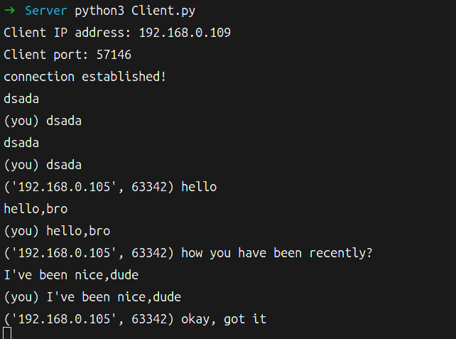
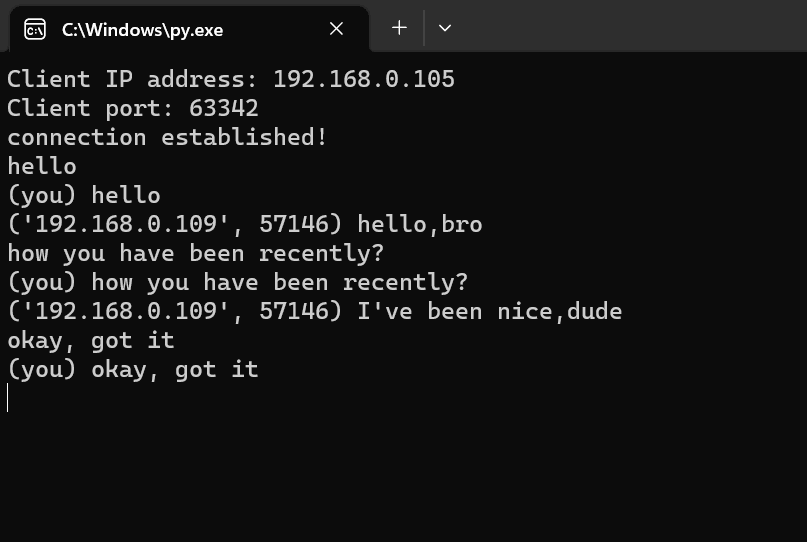
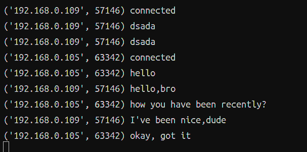

# chat_room
A very simple chat room implemented by python, which can chat in real time, specify the server IP and port when connecting, the client sends a message to the server, and the server forwards the received message to all connected clients.

Currently there is only CLI, no graphical interface is implemented, other user names are displayed as domain names, and the current user is displayed as 'you'

The technology involves socket and multi-threading, but they are very basic, and they are my beginners and practice works.

## how to use
1. modify the value of parameter `server_name` as the server's IP address, `port_num` as the server's port.
2. double click the `Client.py` file and before that make sure there is one user starts the `Server.py` file as the server.
3. then after the prompt, you can enter anything you'd like to say!

# 网络聊天室
通过python实现的一个非常简单的聊天室，可以进行实时聊天，连接时指定服务器IP及端口，客户端向服务器发送消息，服务器再将收到的消息转发给所有连接中的客户端。

目前只有CLI，没有实现图形界面，其他用户名称显示为域名，当前用户则显示为'you'

技术涉及到了socket、多线程，但都十分基础，是本人的初学与练习之作。

## 如何使用
1. 将参数`server_name`的值修改为服务器的IP地址，`port_num`的值为服务器的端口。
2. 双击 `Client.py` 文件，在这之前，先确保有一个用户作为服务器启动了 `Server.py` 文件。
3. 然后在提示后，您可以输入任何您想说的内容！

## demo
客户端1/Client1:

客户端2/Client2:

服务端/Server:
